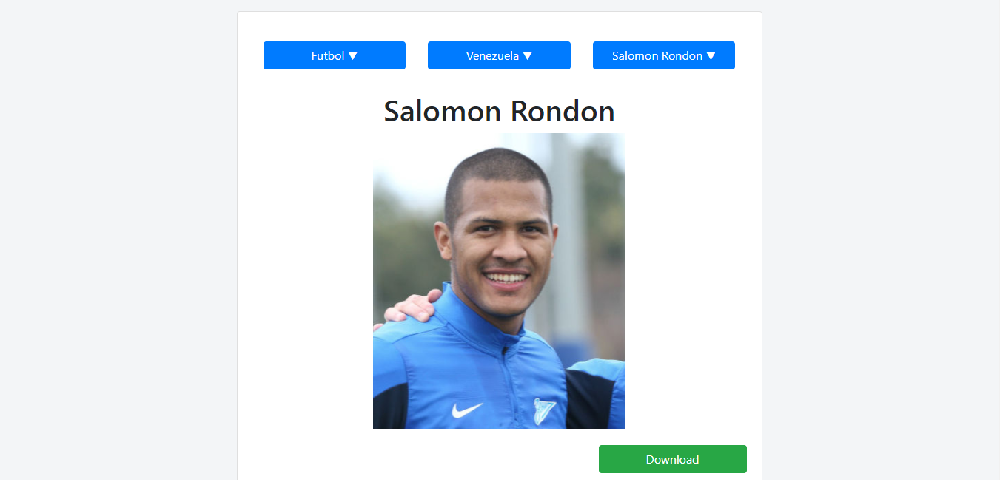

# Player Img Downloader - React

> A Football and Basketball players image downloader.



## Built With

- React
- Boostrap
- JavaScript

## Live Demo

[Live Demo Link](https://elberthcorniell-calculator.herokuapp.com/)

## Getting Started

To get a local copy up and running follow these simple example steps.

### Prerequisites

- Node

### Setup

1- Clone the repository
```
    git clone https://github.com/elberthcorniell/player-img-downloader.git
```

2- Open the folder. 
```
    cd player-img-downloader
```

3- Install all dependencies
```
    yarn add
```

3- Run the app
```
    npm start
```

4- Everything should be running by now. 

### Testing
```
    npm test
```

## Author

👤 **Elbert Corniell**

- GitHub: [@elberthcorniell](https://github.com/elberthcorniell)
- Twitter: [@elberthcorniell](https://twitter.com/elberthcorniell)
- LinkedIn: [LinkedIn](https://www.linkedin.com/in/elbert-corniell-989183159/)

## 🤝 Contributing

Contributions, issues, and feature requests are welcome!

Feel free to check the [issues page](https://github.com/elberthcorniell/player-img-downloader/issues).

## Show your support

Give a ⭐️ if you like this project!


## 📝 License

This project is [MIT](./LICENSE) licensed.
